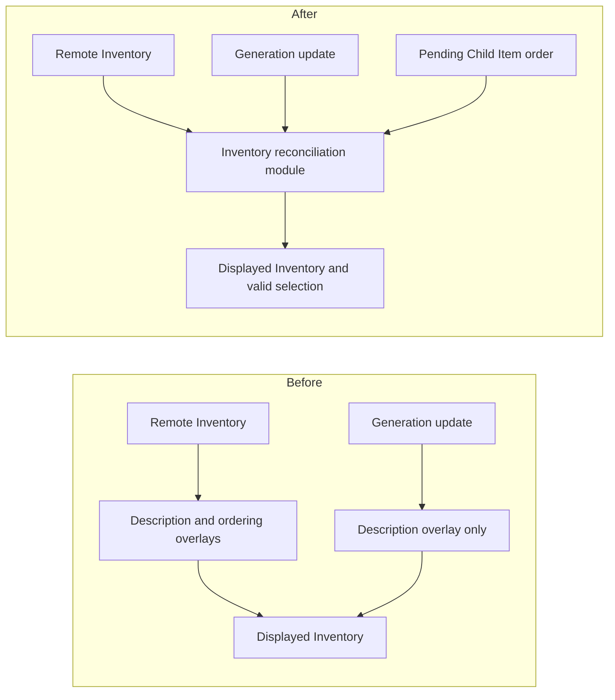
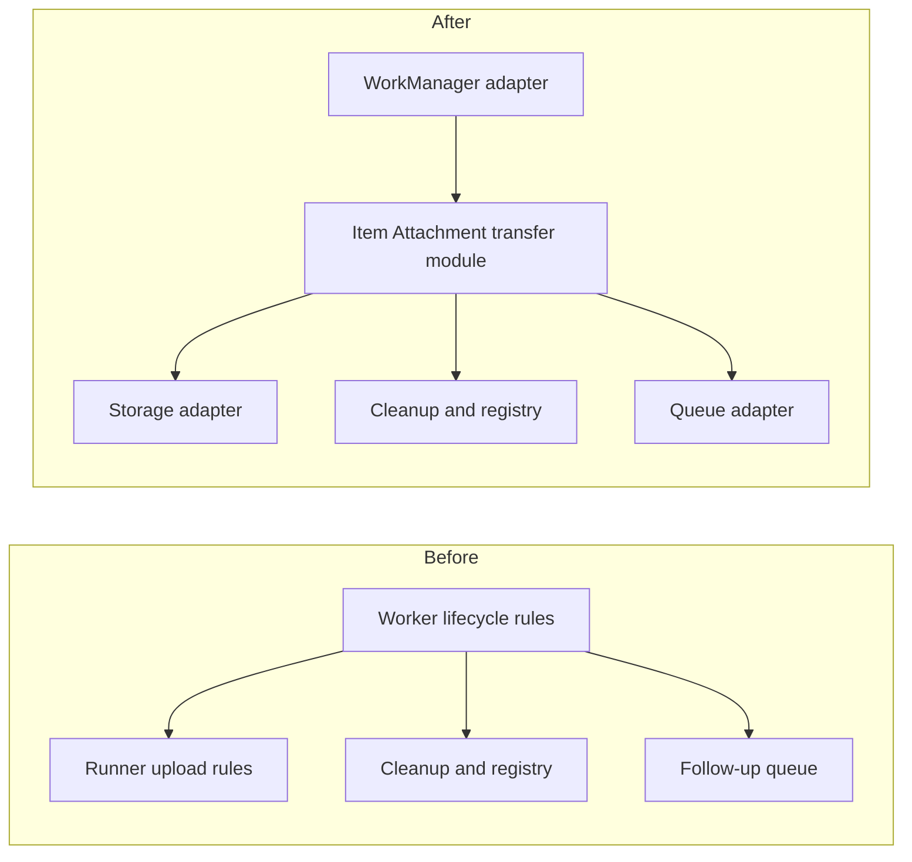

# MyStuffApp: architecture, UI, and UX review

Reviewed 5 September 2026 · Base commit `993c9cb` plus the current working tree.

The best first improvement is to concentrate Inventory reconciliation in one module: two existing observers rebuild the displayed Inventory differently. Next, preserve editing state across Android recreation and make the Item Attachment transfer lifecycle testable through the same interface that production uses. The most immediate UI gains are accessible reordering, reachable Save actions, and clearer navigation through long Item Paths.

## Scope and confidence

This is a source-based review, informed by [CONTEXT.md](../../CONTEXT.md), the six [ADRs](../adr/), local specifications, existing tests, and the last 60 commits. In that history, `HouseholdRootScreen.kt` appears in 38 commits, `InventoryController.kt` in 15, and `FirebaseInventoryGateway.kt` in 13. Those areas received the most attention. The UI entry, capture, crop, photo loading, Move, Search, and invitation journeys were also inspected.

Eight files already had uncommitted changes, including thumbnail preparation and retry behavior. Findings refer to that working tree; line references may move. This review adds documentation only. The app was not launched, and build, device, emulator, and accessibility tests were not run. Code observations are distinguished below from UX hypotheses and validation work.

The requested Markdown report replaces the skill's usual HTML presentation. Diagrams describe responsibility changes, not proposed Kotlin interfaces. Effort is relative: **S** is a localized change, **M** spans a journey and its tests, **L** crosses persistence or Android lifecycle behavior.

## Priorities

| ID  | Proposal                                              | Strength        | Effort | Main payoff                                      |
| --- | ----------------------------------------------------- | --------------- | ------ | ------------------------------------------------ |
| A1  | Concentrate Inventory reconciliation                  | Strong          | M      | Pending changes survive unrelated updates        |
| A2  | Give Item editing a lifecycle-aware owner             | Strong          | L      | Drafts and navigation survive recreation         |
| A3  | Deepen Item Attachment transfer orchestration         | Strong          | M      | Tests exercise production sequencing and cleanup |
| A4  | Concentrate Item Photo loading policy                 | Worth exploring | M      | Cache and preview behavior have one owner        |
| U1  | Clarify Item Path and Search navigation               | Strong          | M      | Members know where they are and where Add saves  |
| U2  | Keep Save reachable and distinguish photo actions     | Strong          | M      | Less scrolling and fewer ambiguous actions       |
| U3  | Make reordering accessible and geometry-aware         | Strong          | M      | Reliable ordering beyond one drag gesture        |
| U4  | Explain loading, empty Inventory, and recovery states | Strong          | S–M    | Members can distinguish waiting from emptiness   |
| U5  | Add explicit invitation sharing actions               | Worth exploring | S      | Faster Household onboarding                      |

## Architecture proposals

### A1 — Concentrate Inventory reconciliation

**Evidence.** [InventoryController.kt](../../app/src/main/java/com/azhidkov/mystuff/InventoryController.kt), lines 368–408, applies both Description Generation overlays and pending Child Item orders when a remote Inventory arrives. Its Description Generation observer, lines 419–436, instead assigns `observedInventory.withDescriptionGenerationOverlays()` without the pending orders. The controller also owns selection repair, Move target repair, and Search-result repair.

**Problem.** Reordering while Description Generation is pending can produce a displayed order that depends on which observer runs last. The inconsistent reconstruction is code-confirmed; the visible interleaving has not been reproduced on a device. Understanding the displayed Inventory currently requires following several event paths.

**Proposal.** Deepen the Inventory module by concentrating the rules that combine observed Items, pending local changes, and valid selections. Route relevant events through that implementation before publishing state. Keep persistence and WorkManager behavior behind their existing seams; do not replace the controller with a generic event framework.

**Depth and deletion test.** The existing controller earns its keep; deleting it would move substantial rules into callers. The opportunity is to remove competing reconstruction paths. A shared implementation creates locality for consistency rules and leverage for every observer. Keep the existing controller interface as the initial test surface, using the existing fake gateway and background-work adapter.

**Acceptance and tests.** Reorder two Child Items, emit a generation update before persistence acknowledges the order, and verify the order remains visible. Repeat with reversed event order, generation failure, a remote Move, and deletion of the selected Item. Extend the existing [controller tests](../../app/src/test/java/com/azhidkov/mystuff/InventoryControllerTest.kt), rather than duplicating them behind a new interface.

**Decision constraints.** Preserve the overwrite behavior and device ownership in [ADR-0001](../adr/0001-description-generation-overrides-newer-input.md) and [ADR-0002](../adr/0002-device-owned-description-generation-with-firebase-ai-logic.md). This proposal repairs local presentation, not concurrent-write policy.

### A2 — Give Item editing a lifecycle-aware owner

**Evidence.** [MainActivity.kt](../../app/src/main/java/com/azhidkov/mystuff/MainActivity.kt), lines 28–43 and 110–143, constructs session dependencies in `onCreate` and retains Inventory and invitation controllers with `remember`. [InventoryController.kt](../../app/src/main/java/com/azhidkov/mystuff/InventoryController.kt), lines 339–343, initializes selection at the Household root. [CameraCaptureStep](../../app/src/main/java/com/azhidkov/mystuff/ui/ItemPhotoCaptureUi.kt), lines 53–67, retains the pending camera URI only with `remember`. Draft cleanup and form exit decisions also appear in [HouseholdRootScreen.kt](../../app/src/main/java/com/azhidkov/mystuff/ui/HouseholdRootScreen.kt), lines 194–223 and 1057–1084, and the capture/crop modules.

**Problem.** There is no explicit restoration path for the active draft, selected Item, Search context, and camera target. Activity recreation replaces these owners; a camera result needs to reconnect to the original draft and URI. This is a lifecycle risk supported by the code, not a claim that ordinary recomposition loses state.

**Proposal.** Give the Item editing module ownership of draft transitions, temporary-photo ownership, and restoration. Retain its state owner across configuration changes and save the small values needed to reconstruct the journey after system process recreation. Revalidate the Household, Item, and local file references on restoration. Keep image bytes in appropriate local files, outside saved-state payloads. A ViewModel with saved-state support is a candidate mechanism, not a reason to rewrite every controller. Android distinguishes retained state from small saved state used to reconstruct a screen: [Save UI state in Compose](https://developer.android.com/develop/ui/compose/state-saving?hl=en).

| Before                                                       | After                                                                       |
| ------------------------------------------------------------ | --------------------------------------------------------------------------- |
| Activity recreation → new controller → root selection        | Lifecycle owner → restored Item and valid draft                             |
| Camera UI remembers URI; several screens delete sources      | Item editing module owns source lifetime; camera adapter returns its result |
| Screen branch ordering coordinates several nullable journeys | One owner coordinates entry, continuation, and exit                         |

**Depth and deletion test.** Merely moving private composables into files would leave the interface and ownership burden unchanged. Move the lifecycle rules with the journey. This gives locality to draft recovery and leverage to every capture/edit entry point. Use a real Android saved-state adapter and a deterministic restoration adapter in tests at the seam; leave view-only details local to Compose.

**Acceptance and tests.** Rotate during editing, recreate while the external camera is open, restore after system process death, and sign out before restoration. Recover the correct draft or explain a missing photo without silently discarding text. Add a small device journey test set: current Android tests cover logo rendering and photo encoding, not these transitions.

**Decision constraints.** Preserve camera-first creation. Draft restoration does not extend failed attachment retry beyond its explicitly process-only lifetime. Keep WorkManager ownership of already-submitted Description Generation work.

### A3 — Deepen Item Attachment transfer orchestration

**Evidence.** [InventoryPhotoBackgroundWork.kt](../../app/src/main/java/com/azhidkov/mystuff/InventoryPhotoBackgroundWork.kt), lines 452–463, gives `PhotoTransferRunner` upload execution and failure dispatch. Lines 470–505 leave follow-up enqueueing, local-source cleanup, failure-registry updates, and scheduler completion mapping inside `InventoryPhotoTransferWorker`. A failed transfer intentionally reports scheduler success so dependent Description Generation can report its stage-specific failure.

**Problem.** The tested runner's interface does not encompass the lifecycle production actually executes. Important ordering knowledge remains in the Android worker. In [InventoryPhotoBackgroundWorkTest.kt](../../app/src/test/java/com/azhidkov/mystuff/InventoryPhotoBackgroundWorkTest.kt), the follow-up upload test manually advances the sequence, which cannot establish that the worker advances it correctly.

**Proposal.** Put transfer progression, cleanup, terminal outcomes, and follow-up scheduling decisions inside the Item Attachment transfer module. Make the WorkManager adapter responsible for translating scheduler input and output. Preserve the independent handling of sibling attachments and the current distinction between transfer failure and scheduler completion.

**Depth and deletion test.** Deleting the current runner would concentrate much of its small implementation in the worker; deepen it rather than add another pass-through module. Locality improves when one implementation owns the lifecycle. Leverage improves when the same interface lets production and tests exercise a complete transfer. Existing storage and queue fakes justify the seam; speculative storage-provider adapters do not.

**Acceptance and tests.** Exercise full-image success followed by thumbnail failure, follow-up scheduling failure, source cleanup timing, sibling success, and dependent Description Generation failure reporting through the production orchestration path. Keep a focused WorkManager wiring check for serialization and outcome mapping.

**Decision constraints.** [Attachment issue 08](../../.scratch/item-attachments/issues/08-report-attachment-upload-failures.md) explicitly requires terminal failures and process-only manual Retry/Remove. Durable retries and automatic upload backoff would be product changes, not refactoring.

### A4 — Concentrate Item Photo loading policy - Implemented

**Evidence.** [ItemPhotoUi.kt](../../app/src/main/java/com/azhidkov/mystuff/ui/ItemPhotoUi.kt), lines 245–293 and 332–369, combines preview sequencing and singleton loader construction with Compose. [StoredPhotoLoader.kt](../../app/src/main/java/com/azhidkov/mystuff/ui/StoredPhotoLoader.kt), lines 57–165 and 168–223, implements thumbnail and attachment caches with repeated atomic-write logic. The carousel also directly loads and evicts files in [HouseholdRootScreen.kt](../../app/src/main/java/com/azhidkov/mystuff/ui/HouseholdRootScreen.kt), lines 833–844 and 969–970.

**Problem.** Cache preparation, display resolution, lifetime, and screen actions meet across several modules. The remaining opportunity is ownership of the whole photo presentation policy, not replacement of working caches.

**Proposal.** Concentrate preview-to-full loading, cache invalidation, and request ownership in the Item Photo loading module. Keep display composables focused on rendering. Share atomic file-writing implementation privately where appropriate. Address the already-planned [obsolete-thumbnail eviction](../../.scratch/thumbnail-cache/issues/04-evict-obsolete-thumbnail-revisions.md) and [authentication-change cleanup](../../.scratch/thumbnail-cache/issues/05-clear-thumbnails-at-authentication-boundaries.md) there.

| Before                                                                 | After                                                    |
| ---------------------------------------------------------------------- | -------------------------------------------------------- |
| Compose coordinates retry and preview; carousel coordinates cache work | Item Photo loading module owns presentation progression  |
| Two cache implementations repeat file writes                           | Shared private file-write implementation                 |
| Loader globals have no clear session teardown point                    | Session changes reach the loading module's existing seam |

**Depth and deletion test.** The caches contain meaningful behavior; deleting them would push complexity into callers. Consolidate policy and duplicate implementation instead. This creates locality for cancellation and invalidation races, and leverage across detail, compact, and carousel views. Test the interface using the existing download/decode adapter substitutions. Verify that a late request cannot repopulate a cleared session cache and that a late preview cannot replace a full photo.

**Decision constraints.** [Carousel issue 04](../../.scratch/item-attachments/issues/04-open-attachment-carousel.md) explicitly requests eager downloads of every display image and no application-defined cache size limit. Bounded concurrency or adjacent-page prefetch could be explored after measurement, but changing eager loading or trimming policy requires revisiting that issue. No such policy change is assumed here; ADR-0006's immutable Item Attachment identity and Item Photo projection remain intact.

## UI and UX proposals

### U1 — Clarify Item Path and Search navigation

**Evidence.** [HouseholdRootScreen.kt](../../app/src/main/java/com/azhidkov/mystuff/ui/HouseholdRootScreen.kt), lines 258–270 and 431–452, handles Back through Search/selection conditions and draws the entire Item Path in one unscrollable `Row`. Lines 1015–1025 show a generic Add action. [InventoryController.kt](../../app/src/main/java/com/azhidkov/mystuff/InventoryController.kt), lines 543–549, chooses a different Parent Item depending on whether the Member is browsing, viewing Search results, or has opened a result.

**Problem.** Long names and deep trees risk crowded or clipped navigation. Add beneath a Search result creates a sibling rather than a Child Item, a deliberate behavior that the generic icon does not explain. Search results themselves have no explicit Back handling when no result is open.

**Proposal.** Show the current Item and immediate Parent Item clearly; make the complete Item Path available through an expandable path view. Define predictable Back transitions between results, opened results, and browsing. Label the Add destination in context and retain the existing form's Parent Item path.

| Before                                                         | After                                                      |
| -------------------------------------------------------------- | ---------------------------------------------------------- |
| `Our Home → Very long … → Cabinet → Drill` competes in one row | `Cabinet → Drill` with an accessible full Item Path action |
| `+` from several contexts                                      | `Add to Cabinet` or an equally clear destination label     |
| Back behavior follows dispersed conditions                     | Result → results → previous browse context                 |

**Architecture and validation.** Give the Inventory navigation module locality for these rules; a consistent interface provides depth and leverage for touch and system-Back callers. Keep the Android Back adapter at the seam. The deletion test rejects a separate helper that merely repeats the same conditions. Test a ten-level tree, long names, restored Search, and creation from each context. Confirm the proposed Back behavior against the existing [Search contract](../../.scratch/search/spec.md) before implementation; Parent Item selection is preserved.

### U2 — Keep Save reachable and distinguish photo actions

**Evidence.** [HouseholdRootScreen.kt](../../app/src/main/java/com/azhidkov/mystuff/ui/HouseholdRootScreen.kt), lines 1113–1133, gives each selected photo a 200 dp preview; Tags and suggestions each consume list rows at 1305–1361. Save and Save & generate description appear together only at the end of that list, lines 1380–1424, with equal tonal emphasis. Some replacement and attachment-picker actions use the same camera artwork at 1147–1154 and 1206–1214.

**Problem.** Several photos and Tags can move Save far below the edited fields. Equal-width actions and long labels may crowd narrow screens. The same artwork conceals different photo operations. These layout risks need device validation.

**Proposal.** Keep Save in a keyboard-aware action area. Make Save the primary action and Save & generate description a clearly secondary action, visible only in the supported edit context. Use compact removable Tag chips and a compact selected-photo strip where useful. Distinguish Take photo, Choose photos, Replace Item Photo, and Add attachments with clear labels. Preserve local validation and automatic continuation after capture.

| Before                                                                    | After                                                                    |
| ------------------------------------------------------------------------- | ------------------------------------------------------------------------ |
| Large previews → fields → Tag rows → suggestions → two equal Save actions | Scrollable editor + reachable primary Save + secondary generation action |
| Similar camera icons for different intents                                | Explicit capture, selection, replacement, and attachment labels          |

**Architecture and validation.** Keep form layout and action eligibility inside the Item editing module. Locality comes from one owner of editable state; leverage and depth come from rendering that state through the same interface across screen sizes. The camera/picker adapter is the actual platform seam. The deletion test does not justify extracting every field into a forwarding module. Check small screens, landscape, large fonts, keyboard visibility, many photos, and 20 Tags. Use semantic journey assertions rather than tests tied to layout nesting.

**Decision constraints.** The [Description Generation specification](../../.scratch/item-description-generation/spec.md) already describes a primary Save and secondary generation action. Preserve ordinary Save waiting for confirmation, generation's immediate close, and the deliberate absence of generation progress or success notifications. A draft-discard confirmation would be a separate UX choice, not assumed here.

### U3 — Make reordering accessible and geometry-aware

**Evidence.** [HouseholdRootScreen.kt](../../app/src/main/java/com/azhidkov/mystuff/ui/HouseholdRootScreen.kt), line 259 and lines 531–550, uses a fixed 56 dp reorder threshold and a 24 dp custom pointer-input box. Rows may contain 64 dp photos plus padding or wrap long names. The handle supplies a description but no accessibility reorder actions.

**Problem.** Fixed drag distance does not reflect actual row positions. Members using TalkBack, Switch Access, or a keyboard cannot invoke a drag solely from its label.

**Proposal.** Use measured row positions for drag crossings, retain stable Item identities, and add accessible “Move earlier” and “Move later” actions with sensible first/last-item behavior. Give the drag handle an adequate interaction area. Android recommends accessible alternatives to gestures and approximately 48 dp touch targets; automatic expansion of standard clickable controls does not establish the behavior of this custom drag box. See [accessibility principles](https://developer.android.com/guide/topics/ui/accessibility/principles) and [Compose accessibility defaults](https://developer.android.com/develop/ui/compose/accessibility/api-defaults).

| Before                                   | After                                                                     |
| ---------------------------------------- | ------------------------------------------------------------------------- |
| Drag 56 dp → request adjacent reorder    | Cross measured row position → request adjacent reorder                    |
| Drag is the only exposed reorder gesture | Drag, accessibility actions, and keyboard operation reach the same intent |

**Architecture and validation.** Deepen the Child Item ordering interaction module around measured placement and supported actions. Keep shared-order persistence behind the existing controller interface. A gesture adapter and accessibility adapter justify the seam; locality prevents divergent ordering rules, while leverage lets both inputs exercise the same behavior. The deletion test favors keeping actual ordering policy, not a new forwarding module. Test mixed photo/no-photo rows, wrapped names, large fonts, TalkBack, rapid drags, and a failed remote reorder.

### U4 — Explain loading, empty Inventory, and recovery states

**Evidence.** [HouseholdRootScreen.kt](../../app/src/main/java/com/azhidkov/mystuff/ui/HouseholdRootScreen.kt), lines 512–598, renders Child Items only when present and places ordinary errors after the list. Loading is used to hide Add, but the browse branch has no corresponding explicit loading/empty presentation. `empty_household_body` exists in [strings.xml](../../app/src/main/res/values/strings.xml) but is not used there. Search already has a no-results message and loading indicator.

**Problem.** A root without visible Child Items can mean first use, loading, or an unsuccessful load. A recovery message at the bottom of a long list is easy to miss.

**Proposal.** Distinguish initial loading, successfully loaded empty Child Items, content with a refresh failure, and load failure without usable content. Explain “No Child Items yet” with an Add action after loading succeeds. Keep existing content visible during recoverable refresh failure and put actionable failure feedback near the top. Add Retry only where it maps to a real load operation.

| Before                                | After                                                          |
| ------------------------------------- | -------------------------------------------------------------- |
| No Child Item rows; Add may be absent | Loading indication, empty-state guidance, or explicit recovery |
| Error below the entire list           | Error near the affected task with a meaningful next action     |

**Architecture and validation.** Give the Inventory presentation module locality for interpreting load state. Its interface should offer depth and leverage to browsing and first-use rendering without promising custom offline behavior. Use the existing gateway adapter at the seam; the deletion test favors concentrating state interpretation rather than scattering identical boolean checks. Exercise empty success, delayed first load, failed first load, and refresh failure with cached content.

**Decision constraints.** Do not expose cloud Search failures or literal/conceptual labels: silent fallback is explicit in the [Search specification](../../.scratch/search/spec.md). Do not infer “offline” merely from cached content or add offline availability guarantees.

### U5 — Add explicit invitation sharing actions

**Evidence.** [HouseholdRootScreen.kt](../../app/src/main/java/com/azhidkov/mystuff/ui/HouseholdRootScreen.kt), lines 1505–1527, shows a selectable invitation link followed by Revoke and Replace. Sharing currently relies on selecting the text.

**Proposal.** Add clearly labelled Copy link and Share actions to pending invitations, retaining intended email, expiry, and status. Explain that the intended Member must sign in with the matching Google identity. Keep Revoke and Replace visually separate from sharing.

| Before                                          | After                                             |
| ----------------------------------------------- | ------------------------------------------------- |
| Select a long link → copy manually → switch app | Copy link or Share → destination chosen by Member |

**Architecture and validation.** Keep invitation eligibility and status in the invitation module. An Android clipboard/share adapter sits at the platform seam; there is no need for a generic sharing framework. Locality comes from one eligibility rule and leverage from reusing it for both actions. The deletion test favors direct platform integration unless a shared module adds actual depth beyond forwarding the interface. Verify pending, expired, accepted, replaced, and revoked invitations, plus joining with the wrong identity. This review sends no invitations.

## Preserve the useful foundations

The generic Item tree and explicit domain glossary give good names to modules. Immutable Item Attachments and Item Photo projection are an established decision. Pure Inventory rules, fake gateways, background workflow tests, and Firebase authorization/emulator tests provide useful existing seams. Keep them while moving behavior to the appropriate test surface.

Avoid a package-wide rewrite, mandatory use-case class per action, or a new dependency-injection framework solely because several files are large. File size helped identify active areas; the actual proposals above depend on leaked ownership, inconsistent rules, or concrete journey friction.

Household membership management, root renaming/deletion, and broader prototype validation already have [local issues](../../.scratch/household-inventory/issues/). Schedule them through that backlog rather than presenting unfinished product scope as architectural defects. Likewise, extend existing thumbnail-cleanup issues instead of duplicating them.

## Suggested implementation order

1. **A1:** Reproduce the observer-order interaction through the controller interface, then centralize reconciliation. This is the top recommendation because it has a specific inconsistency, a bounded change, and observable tests.
2. **U3 and U2:** Improve accessible reordering and Save/action clarity, checking the current screens on a device before settling layout details.
3. **A2:** Address draft and camera restoration as one coherent editing journey, with focused device coverage.
4. **A3:** Move transfer lifecycle behavior behind the tested seam while preserving current failure semantics.
5. **A4, U1, U4, U5:** Address loading ownership and navigation/onboarding improvements in small follow-up changes, reusing pending issues where applicable.

For UI validation, use a small phone, landscape, large fonts, TalkBack, a deep Inventory, long names, many Item Attachments, and two connected Members. Measure task success—resume a draft, find an Item, choose the intended Parent Item, reorder, and recover from failure—before introducing broader visual redesigns. Performance changes to eager photo loading remain speculative until measured.
